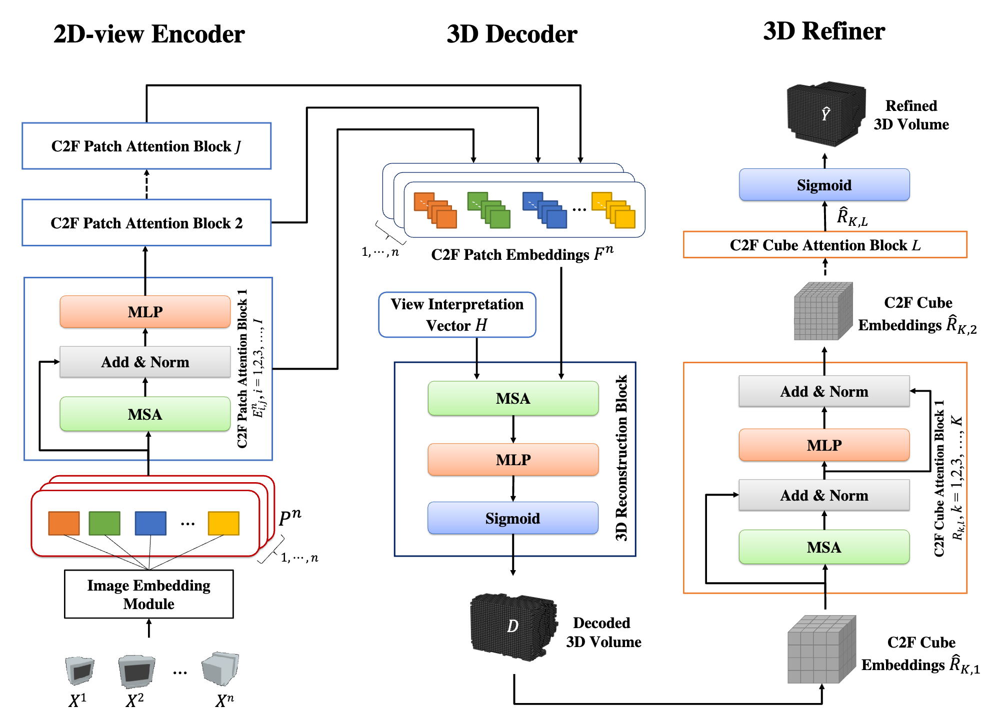

<h1 align="center">
    3D-C2FT: Coarse-to-fine Transformer for Multi-view 3D Reconstruction
</h1>
<p align="center">
    Leslie Ching Ow Tiong<sup>*,1</sup>,  Dick Sigmund<sup>*,2</sup>, Andrew Beng Jin Teoh<sup>&dagger;,3</sup>
    <br/>
    <sup>1</sup>Korea Institute of Science and Technology, <sup>2</sup>AIDOT Inc., <sup>3</sup>Yonsei University
    <br/>
    <sup>*</sup>These authors contributed equally
    <br/>
    <sup>&dagger;</sup>Corresponding author
    <br/><br/>
    <a href="https://openaccess.thecvf.com/content/ACCV2022/html/Tiong_3D-C2FT_Coarse-to-fine_Transformer_for_Multi-view_3D_Reconstruction_ACCV_2022_paper.html">
        
    </a>
</p>
<br/>

## Introduction
This repository contains the source code for the paper [3D-C2FT: Coarse-to-fine Transformer for Multi-view 3D Reconstruction](https://openaccess.thecvf.com/content/ACCV2022/papers/Tiong_3D-C2FT_Coarse-to-fine_Transformer_for_Multi-view_3D_Reconstruction_ACCV_2022_paper.pdf), which is accepted by **ACCV 2022**.
<p align="center">
    
</p>


## Dataset
We use the ShapeNet and Multi-view Real-life datasets, which are available as follows:
- [ShapeNet](https://shapenet.org)
- [Multi-view Real-life](https://github.com/tiongleslie/3D-C2FT/tree/main/dataset)
<br/> <br/>


## Compatibility
We tested the codes with:
  1) PyTorch 1.12.0 with and without GPU under Ubuntu 18.04 and Anaconda3 (Python 3.8 and above)
  2) PyTorch 1.10.2 with and without GPU under Windows 10 and Anaconda3 (Python 3.7 and above)
  3) PyTorch with CPU under MacOS 12.0 (M1) and Anaconda3 (Python 3.7 and above)
<br/> <br/>


## Requirements
  1) [Anaconda3](https://www.anaconda.com/download)
  2) [PyTorch](https://pytorch.org/get-started/locally)
  3) [Matplotlib](https://anaconda.org/conda-forge/matplotlib)
  4) [Open3D](http://www.open3d.org/docs/release/getting_started.html)
  5) [PyMCubes](https://pypi.org/project/PyMCubes)
  6) [Natsort](https://pypi.org/project/natsort)
<br/> <br/>  


## Usage
- Run the code `eval.py` with the given configuration in config.py
```shell
$ python eval.py
```
<br/> <br/>


## Pretrained Model
The pretrained model is available at here:
- [3D-C2FT](https://drive.google.com/file/d/1shLa0ikbiV6Ue59k5Pib66PjzOkx6Gfz/view?usp=sharing)
<br/> <br/>


## License
This work is an open-source under MIT license.
<br/> <br/>


## Cite this work
```
@InProceedings{3DC2FT_2022_ACCV,
    author    = {Tiong, Leslie Ching Ow and Sigmund, Dick and Teoh, Andrew Beng Jin},
    title     = {3D-C2FT: Coarse-to-fine Transformer for Multi-view 3D Reconstruction},
    booktitle = {Proceedings of the Asian Conference on Computer Vision (ACCV)},
    month     = {December},
    year      = {2022},
    pages     = {1438-1454}
}
```
